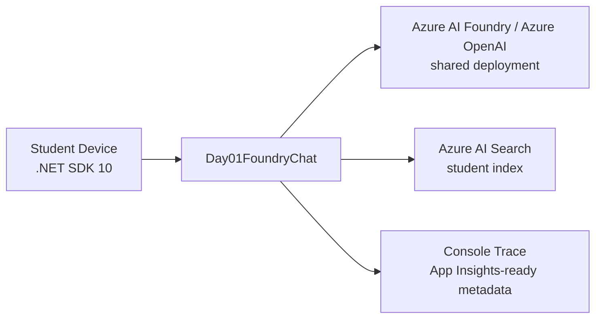

# Day 1 Architecture

## Live Azure Resources

| Resource | Expected Name Pattern |
|---|---|
| Shared platform RG | `rg-ai-shared-platform-an2607101` |
| Observability RG | `rg-ai-observability-an2607101` |
| Student RG | `rg-st-2606-1000-ai-native-an2607101` |
| Search service | `srch-an2607101` |
| Student Search index | `idx-st26061000-grounding` |

