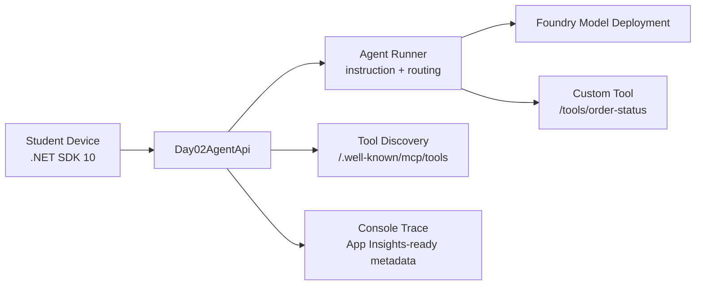

# Day 2 Architecture

## Live Azure Resources

| Resource | Expected Name Pattern |
|---|---|
| Shared platform RG | `rg-ai-shared-platform-an2607101` |
| Observability RG | `rg-ai-observability-an2607101` |
| Student RG | `rg-st-2606-1000-ai-native-an2607101` |
| Student managed identity | `id-st26061000-training-cin` |

