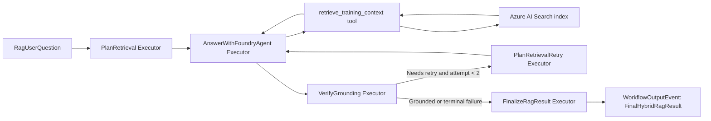

# Lab 06 - Hybrid RAG for Agentic Workflow

## Purpose

Lab 06 shows how retrieval becomes an explicit step inside an agentic workflow instead of being hidden inside a prompt.

The lab uses:

- Microsoft Agent Framework Workflows for orchestration.
- A Foundry-backed Agent Framework agent for grounded answer generation.
- Azure AI Search for live retrieval from the student's Day 1 RAG index.
- A tool boundary so the agent must request grounding evidence before answering.
- Verification and bounded retry so unsupported answers are not accepted silently.

## Component Contract

| Item | Decision |
|---|---|
| Official capability | Agentic RAG workflow using Microsoft Agent Framework Workflows plus Foundry-backed agent execution |
| Packages | `Microsoft.Agents.AI.Workflows`, `Microsoft.Agents.AI.Foundry`, `Microsoft.Agents.AI`, `Microsoft.Extensions.AI`, `Azure.Search.Documents`, `Azure.Identity` |
| Required classes/methods | `WorkflowBuilder`, `Executor<TInput,TOutput>`, `InProcessExecution.RunStreamingAsync(...)`, `WorkflowOutputEvent`, `IWorkflowContext.QueueStateUpdateAsync(...)`, `AIProjectClient`, `projectClient.AsAIAgent(...)`, `AIFunctionFactory.Create(...)`, `SearchClient.SearchAsync<SearchDocument>(...)` |
| Required code evidence | Retrieval plan executor, Foundry grounded-answer executor, grounding verification executor, retry planner, final typed output, Azure AI Search retrieval tool, citations/provenance in result |
| Forbidden substitutes | No fake RAG answer, no hardcoded model response, no manual workflow engine, no manually simulated tool call, no local-only retrieval as the main path |
| Build acceptance | `dotnet build` for `Lab06HybridRagWorkflow.csproj` must pass with zero errors |

## What Students Learn

Students should understand these concepts before running the lab:

- RAG is not only "attach files to a model"; the agentic version makes retrieval, answering, verification, retry, and termination visible.
- Azure AI Search is the retrieval system. The Foundry agent is the reasoning and response system.
- The agent does not get direct hidden access to documents. It gets an explicit `retrieve_training_context` tool.
- Citations are part of the answer contract. The verification step checks whether the answer cited retrieved document IDs.
- Workflow state captures what happened: request, retrieval plan, answer, document count, verification result, and retry plan.
- Hybrid RAG here means the workflow is designed with replaceable retrieval/runtime boundaries. The required path uses Azure AI Search and Foundry. Vector retrieval, Foundry Local, vLLM, NVIDIA DGX Spark, and neocloud endpoints can be added later as provider choices, but they are not simulated in this lab.

## Architecture



## Required Azure Setup

The lab expects the Day 1 search index to already exist and contain seed data.

For batch `AN-2607-101`, the defaults are:

| Setting | Default |
|---|---|
| Foundry project endpoint | `https://proj-an2607101-default-resource.services.ai.azure.com/api/projects/proj-an2607101-default` |
| Model deployment | `gpt-5-mini` |
| Search service | `https://srchan2607101.search.windows.net` |
| Student index pattern | `idx-st26061000-rag`, `idx-st26061001-rag`, etc. |
| Auth default | `AzureCliCredential` |

The signed-in user or student managed identity must be able to:

- Call the Foundry project/model deployment.
- Read the Azure AI Search index.

For emergency trainer setup, `AZURE_SEARCH_ADMIN_KEY` can be used, but the preferred training path is RBAC.

## Environment Variables

```powershell
$env:AZURE_AI_PROJECT_ENDPOINT="https://proj-an2607101-default-resource.services.ai.azure.com/api/projects/proj-an2607101-default"
$env:AZURE_OPENAI_CHAT_DEPLOYMENT="gpt-5-mini"
$env:BATCH_ID="AN-2607-101"
$env:STUDENT_ID="ST-2606-1000"
$env:AZURE_SEARCH_ENDPOINT="https://srchan2607101.search.windows.net"
$env:AZURE_SEARCH_INDEX_NAME="idx-st26061000-rag"
```

Optional trainer-only key path:

```powershell
$env:AZURE_SEARCH_ADMIN_KEY="<search-admin-key>"
```

Optional retrieval tuning:

```powershell
$env:HYBRID_RAG_RETRIEVAL_MODE="azure-ai-search-text"
$env:HYBRID_RAG_TOP="3"
```

## Run

```powershell
dotnet run --project .\src\Lab06HybridRagWorkflow\Lab06HybridRagWorkflow.csproj
```

## Walkthrough

1. The console prints the live Azure dependencies.
2. Student enters a grounded question.
3. `PlanRetrieval` creates a typed retrieval plan and stores it in workflow state.
4. `AnswerWithFoundryAgent` creates a Foundry-backed `AIAgent`.
5. The agent receives `retrieve_training_context` as an `AIFunctionFactory` tool.
6. The retrieval tool calls `SearchClient.SearchAsync<SearchDocument>(...)`.
7. Retrieved documents are returned to the model as tool evidence.
8. The answer agent must cite documents as `[doc:<id>]`.
9. `VerifyGrounding` checks for retrieved evidence and citation markers.
10. If needed, `PlanRetrievalRetry` expands the query once and loops back.
11. `FinalizeRagResult` emits a typed `FinalHybridRagResult`.
12. The lab writes `day03-lab06-hybrid-rag-result.json` under the lab artifacts directory.

## Trainer Checkpoints

Before delivery:

- Confirm each student index exists and has documents.
- Confirm the signed-in trainer/student can search the index.
- Confirm the Foundry project endpoint and model deployment are correct.
- Run the lab once with `STUDENT_ID=ST-2606-1000`.

During delivery:

- Point out the workflow events printed to console.
- Show where retrieval is a tool, not a hidden SDK call inside the prompt.
- Ask students why the verifier may mark an answer as `not_grounded`.
- Discuss how the same provider boundary can later switch to vector search, Foundry Local, vLLM, DGX Spark, or Runpod without changing the workflow contract.

## Troubleshooting

| Symptom | Likely Cause | Fix |
|---|---|---|
| Search returns zero documents | Student index not seeded or wrong `AZURE_SEARCH_INDEX_NAME` | Seed the index or set the correct index name |
| 403 from Azure AI Search | Missing RBAC or wrong identity | Assign Search Index Data Reader/Contributor or use trainer admin key temporarily |
| Foundry call fails | Wrong project endpoint, missing RBAC, or missing model deployment | Check `AZURE_AI_PROJECT_ENDPOINT`, `AZURE_OPENAI_CHAT_DEPLOYMENT`, and Foundry project access |
| Verification says no citations | Model did not cite `[doc:<id>]` | Rerun, inspect retrieved document IDs, or improve prompt/query |
| Result says not grounded | Retrieval evidence was weak or absent | Check index content and upload/searchable data |

## Acceptance

The lab is accepted when:

- `dotnet build` passes.
- Console events show all workflow executors.
- Azure AI Search is called through `SearchClient.SearchAsync<SearchDocument>(...)`.
- Foundry answer generation uses `AIProjectClient.AsAIAgent(...)`.
- The final artifact contains retrieved document IDs, answer text, verification findings, and terminal status.
