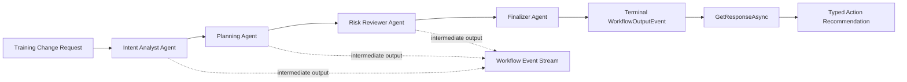

# Lab 07 - Workflow Agent

## Purpose

Lab 07 shows how a structured business process can be implemented as a workflow composed of real Microsoft Agent Framework agents.

The lab uses:

- Foundry-backed `AIAgent` instances for specialist roles.
- `AgentWorkflowBuilder` and `SequentialWorkflowBuilder` for native agent workflow orchestration.
- Workflow streaming events to show each agent's contribution.
- Official structured output through `ChatClientStructuredOutputExtensions.GetResponseAsync<T>(...)`.

## Component Contract

| Item | Decision |
|---|---|
| Official capability | Workflow agent using Microsoft Agent Framework agent workflow orchestration |
| Packages | `Microsoft.Agents.AI.Workflows`, `Microsoft.Agents.AI.Foundry`, `Microsoft.Agents.AI`, `Microsoft.Extensions.AI`, `Microsoft.Extensions.AI.OpenAI`, `Azure.AI.OpenAI`, `Azure.Identity` |
| Required classes/methods | `AIProjectClient`, `projectClient.AsAIAgent(...)`, `AgentWorkflowBuilder.CreateSequentialBuilderWith(...)`, `SequentialWorkflowBuilder.WithChainOnlyAgentResponses(...)`, `OrchestrationBuilderBase.WithIntermediateOutputFrom(...)`, `OrchestrationBuilderBase.WithOutputFrom(...)`, `InProcessExecution.RunStreamingAsync(...)`, `AgentResponseUpdateEvent`, `AgentResponseEvent`, `WorkflowOutputEvent`, `ChatClientStructuredOutputExtensions.GetResponseAsync<T>(...)`, `ChatResponse<T>.TryGetResult(...)` |
| Required code evidence | Four Foundry-backed specialist agents, native sequential workflow builder, streaming workflow execution, intermediate/terminal output handling, typed structured final result |
| Forbidden substitutes | No hand-built agent chain, no custom workflow engine, no direct sequential `agent.RunAsync(...)` calls as the main orchestration, no `Workflow.as_agent()` usage, no fake structured result |
| Build acceptance | `dotnet build` for `Lab07WorkflowAgent.csproj` must pass with zero errors |

## What Students Learn

Students should understand these concepts before running the lab:

- A workflow agent is not just a single prompt with many instructions. It is a workflow where specialist agents own distinct responsibilities.
- `AgentWorkflowBuilder` provides native orchestration patterns for agents. Lab 07 uses sequential orchestration as the bridge from Day 3 workflows to Day 4 multi-agent systems.
- Intermediate outputs let students observe what each agent contributed before the final result.
- Structured output turns the final workflow result into a predictable contract that downstream systems can consume.
- This lab deliberately avoids `Workflow.as_agent()` because it is not verified in the installed C# package surface.

## Agent Roles

| Agent | Responsibility |
|---|---|
| Intent Analyst Agent | Understand the training change request, goal, constraints, and missing information |
| Planning Agent | Turn the intent into an implementation plan with resources, owners, evidence, and fallback |
| Risk Reviewer Agent | Review learner impact, Azure cost/access, delivery timing, governance, and approval needs |
| Finalizer Agent | Produce the final enterprise-ready recommendation |

## Architecture



## Required Azure Setup

The lab uses the same Foundry project and model deployment as the earlier Day 3 labs.

| Setting | Default |
|---|---|
| Foundry project endpoint | `https://proj-an2607101-default-resource.services.ai.azure.com/api/projects/proj-an2607101-default` |
| Azure OpenAI endpoint for structured output | `https://proj-an2607101-default-resource.openai.azure.com/` |
| Model deployment | `gpt-5-mini` |
| Auth default | `AzureCliCredential` |

## Environment Variables

```powershell
$env:AZURE_AI_PROJECT_ENDPOINT="https://proj-an2607101-default-resource.services.ai.azure.com/api/projects/proj-an2607101-default"
$env:AZURE_OPENAI_ENDPOINT="https://proj-an2607101-default-resource.openai.azure.com/"
$env:AZURE_OPENAI_CHAT_DEPLOYMENT="gpt-5-mini"
$env:BATCH_ID="AN-2607-101"
$env:STUDENT_ID="ST-2606-1000"
```

## Run

```powershell
dotnet run --project .\src\Lab07WorkflowAgent\Lab07WorkflowAgent.csproj
```

## Walkthrough

1. The trainer or student enters a training change request.
2. The app creates four Foundry-backed `AIAgent` instances.
3. The app creates a native sequential workflow with `AgentWorkflowBuilder.CreateSequentialBuilderWith(...)`.
4. `WithChainOnlyAgentResponses(true)` ensures each downstream agent receives the previous agent's output instead of the full accumulated transcript.
5. `WithIntermediateOutputFrom(...)` emits the first three specialist agent outputs as intermediate workflow outputs.
6. `WithOutputFrom(...)` designates the finalizer as the terminal output source.
7. `InProcessExecution.RunStreamingAsync(...)` runs the workflow and streams events.
8. The transcript is normalized into `WorkflowAgentStructuredResult` using `GetResponseAsync<T>(...)`.
9. The app writes a JSON evidence artifact under the lab artifacts directory.

## Trainer Checkpoints

Before delivery:

- Confirm `az login` works.
- Confirm the trainer/student has access to the Foundry project.
- Confirm `gpt-5-mini` is deployed and callable.
- Confirm `AZURE_OPENAI_ENDPOINT` is set for structured output.

During delivery:

- Pause after each `AgentResponseEvent` and ask students what the next agent should do with that output.
- Explain why sequential workflow is appropriate for process handoff, while Day 4 will compare concurrent, handoff, group chat, and Magentic patterns.
- Show that the final JSON is not hand-coded. It comes from official structured output and fails if it cannot parse.

## Troubleshooting

| Symptom | Likely Cause | Fix |
|---|---|---|
| Foundry agent call fails | Wrong project endpoint, missing RBAC, or missing model deployment | Check `AZURE_AI_PROJECT_ENDPOINT`, `AZURE_OPENAI_CHAT_DEPLOYMENT`, and Foundry access |
| Structured output fails | Model did not return parseable JSON for the schema | Rerun, reduce prompt ambiguity, or inspect the raw structured-output response |
| No intermediate output appears | Output designation or event stream issue | Check `WithIntermediateOutputFrom(...)` and `AgentResponseEvent` handling |
| Workflow appears to stop early | Upstream agent returned too little context | Rerun with a more specific change request |

## Acceptance

The lab is accepted when:

- `dotnet build` passes.
- Code contains `AgentWorkflowBuilder.CreateSequentialBuilderWith(...)`.
- Code contains `WithChainOnlyAgentResponses(true)`.
- Code contains `WithIntermediateOutputFrom(...)` and `WithOutputFrom(...)`.
- Code uses `AIProjectClient.AsAIAgent(...)` for the specialist agents.
- Code uses `GetResponseAsync<WorkflowAgentStructuredResult>(...)` and `TryGetResult(...)`.
- Runtime writes `day03-lab07-workflow-agent-result.json`.
